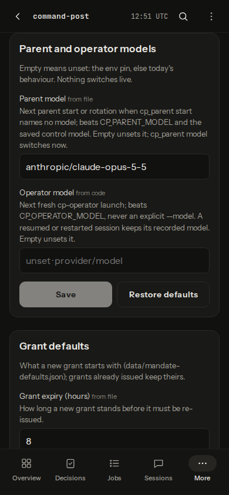
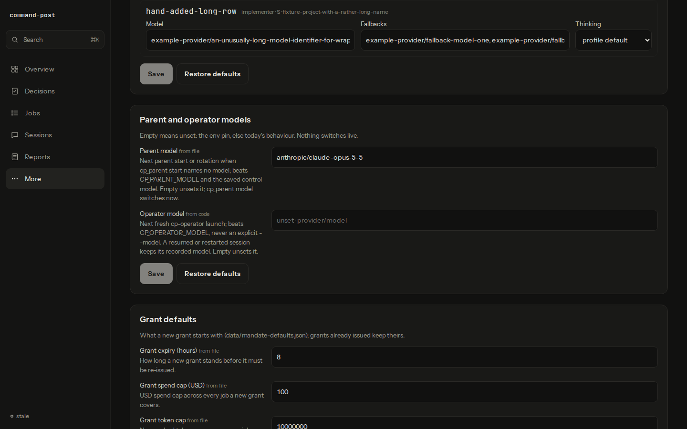

# Settings (minimal) verification

The dashboard `#settings` screen (cp-settings-minimal) in real headless Chromium (Playwright's bundled build), at 390×844 and 1440×900.

## Fixture

A scratch home in a `mktemp -d` directory (mode 0700), removed afterwards; no operational home, `~/.pi` or live viewer was used, and no agent ran.

- `data/routing.json`: `defaults/routing.default.json` plus one hand-added row with a long id, project, model, fallbacks and note (the long-text check).
- `data/mandate-defaults.json`: `SCAFFOLD_MANDATE_DEFAULTS`.
- `data/parent.json`: `{"compact_at_tokens":200000,"model":"anthropic/claude-opus-5-5"}`; `data/operator.json`: `{"compact_at_tokens":200000}`.
- The server mirrors `tests/viewer-settings-http.test.ts`: the real `startDashboardControl` with stub ports plus `settingsPorts(home)`, and `createViewer` with a fresh `buildViewer` app under `requireTailnet` on 127.0.0.1. It was stopped by its recorded PID.

The browser aborted any non-GET request (none were attempted), loaded `/#settings` and was closed in `finally`.

## Captures

Exact viewport size. The shell scrolls inside the page, so each frame is scrolled to a section: the phone shows Parent and operator models with Grant defaults below; the desktop shows the end of Worker models (the hand-added long row), Parent and operator models and Grant defaults. The top of Worker models (the six shipped rows) is covered by `tests/viewer-settings-ui.test.ts`.

## Measured

| Check | 390×844 | 1440×900 |
|---|---|---|
| Sections, in order | Worker models, Parent and operator models, Grant defaults | same |
| Rubric rows | 7 (6 shipped + 1 hand-added) | 7 |
| `scrollWidth` = viewport width | 390 = 390 | 1440 = 1440 |
| Elements past the right edge | 0 | 0 |
| Buttons/inputs/selects under 44 px tall (checkboxes excepted, their labels are 44 px) | 0 | 0 |
| Non-GET requests | 0 | 0 |

The fixture holds no credentials (the push config's key is a fixed dummy); the server log was checked for credential patterns (zero matches), and the captures show only fixture values.
