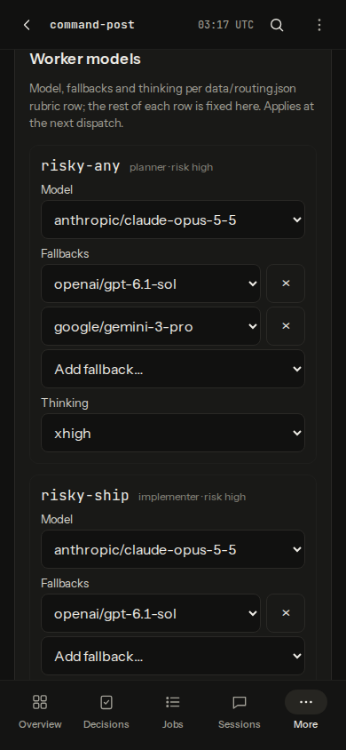
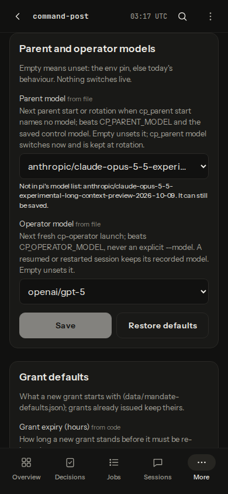
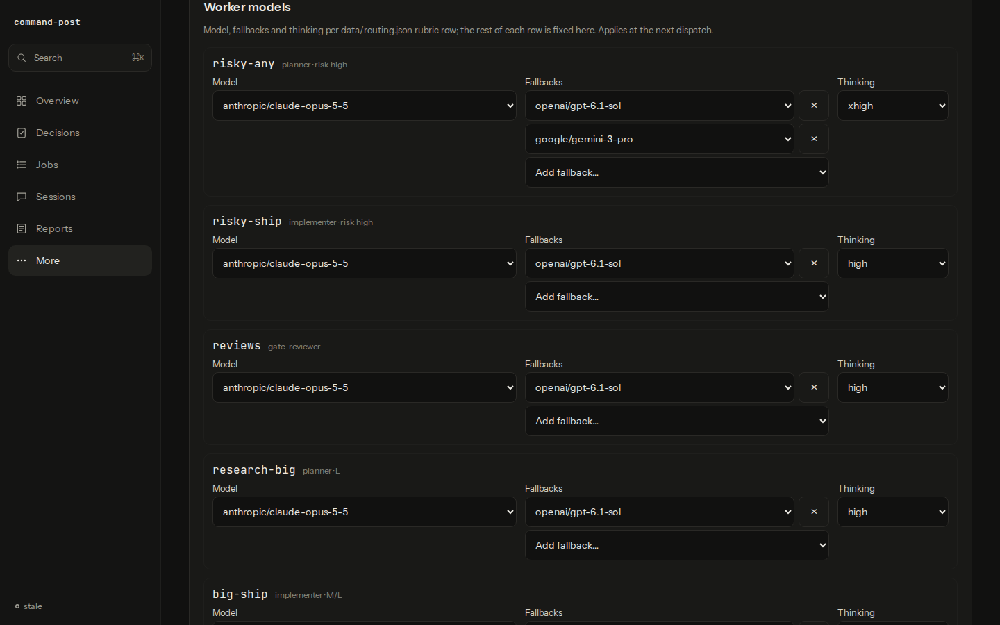
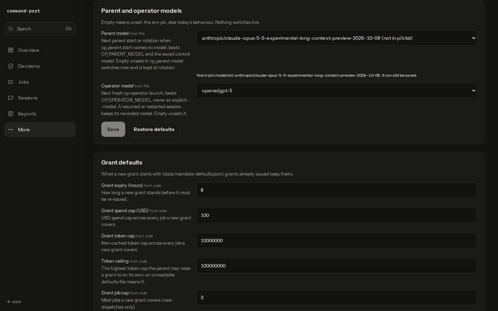
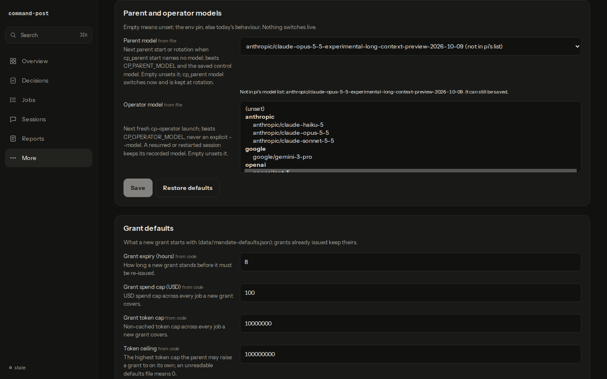

# Settings model dropdowns verification

The `#settings` screen after the model fields became `<select>` dropdowns (cp-lol1), in headless Chromium (Playwright's bundled build), at 390×844 and 1440×900.

## Fixture

A scratch home in a `mktemp -d` directory (mode 0700), removed in `finally`; no operational home, `~/.pi` or live viewer was used, and no agent ran. `pi` was a stub script on PATH in its own `mktemp -d` (removed in `finally`) printing an eight-row `provider model …` table (anthropic ×3, openai ×3, google ×1, and one long openrouter id), so the list comes through the real `src/viewer/model-list.ts` and `GET /api/settings`. The home held `data/routing.json` (the shipped default), `data/parent.json` with a long id pi does not list, and `data/operator.json` with `openai/gpt-5`. The server mirrors `tests/viewer-settings-http.test.ts` (real `startDashboardControl` + `settingsPorts`, `createViewer` with a fresh `buildViewer` app under `requireTailnet` on 127.0.0.1), in the capture script's own process. The browser aborted any non-GET request; the only interaction was picking `google/gemini-3-pro` in the first row's "Add fallback…" dropdown (a local draft, not saved).

## Captures

Closed dropdowns show the selected values: each rubric row's model, one dropdown per fallback with its ×, the "Add fallback…" dropdown and the Thinking select. `openai/gpt-6.1-sol` is in the stub list, so no row warns. Parent model keeps its unlisted value as the selected option "… (not in pi's list)", with the existing warning; at 390 px the long id ellipsizes in the closed dropdown and wraps in the warning.

The native popup is not drawn by headless Chromium, so for this one frame the Operator model select got `size=8` (set by the capture script only) to show the list: "(unset)" first, then one `<optgroup>` per provider, alphabetical, scrolled to the selected `openai/gpt-5`.

## Measured

| Check | 390×844 | 1440×900 |
|---|---|---|
| `#setting-models-parent` optgroups | 4 | 4 |
| Selects on the screen | 28 | 28 |
| `scrollWidth` = viewport width | 390 = 390 | 1440 = 1440 |
| Elements past the right edge | 0 | 0 |
| Selects, text inputs and buttons under 44 px tall | 0 | 0 |

The fixture holds no credentials (the push config's key is a fixed dummy); the captures show only fixture values.
