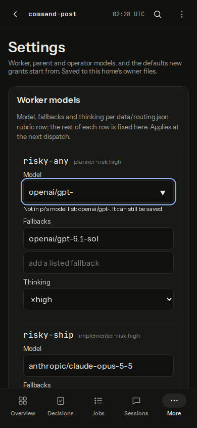
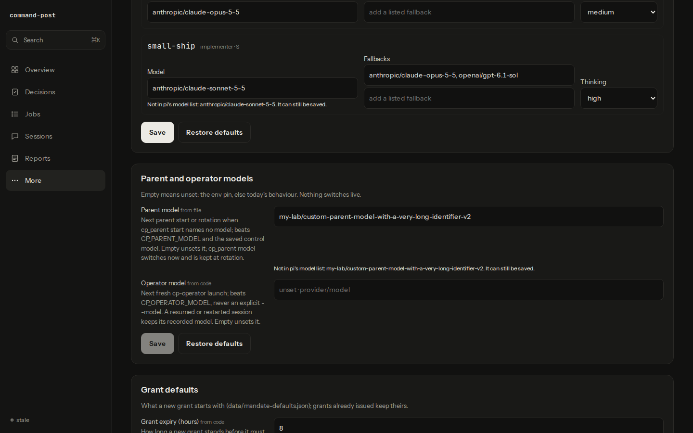

# Settings model pickers verification

The `#settings` screen with `available_models` in headless Chromium (Playwright's bundled build), at 390×844 and 1440×900.

## Fixture

A scratch home in a `mktemp -d` directory, removed afterwards; no operational home, `~/.pi` or live viewer was used, and no agent ran. `pi` was a stub script on PATH in its own `mktemp -d` (removed afterwards) that prints a four-row `provider model …` table, so the list comes through the real `src/viewer/model-list.ts` and the real `GET /api/settings`. The home held `data/routing.json` (the shipped default), and `data/parent.json` with a long, unlisted model id. The server mirrors `tests/viewer-settings-http.test.ts` (real `startDashboardControl` + `settingsPorts`, `createViewer` under `requireTailnet` on 127.0.0.1) and ran in the script's own process. The browser aborted any non-GET request (none were attempted).

## Captures

The first rubric row's Model input holds an unlisted value (`openai/gpt-`), so its inline warning shows; the fallback row has the extra "add a listed fallback" input. The desktop frame shows Parent model with its long unlisted value and warning. Headless screenshots do not draw a browser's native `<datalist>` popup, so the open suggestion list is not captured; the four `<option>` values were counted in the DOM instead.

## Measured

| Check | 390×844 | 1440×900 |
|---|---|---|
| `datalist#settings-models` options | 4 | 4 |
| `scrollWidth` = viewport width | 390 = 390 | 1440 = 1440 |
| Elements past the right edge | 0 | 0 |
| Text inputs, selects and buttons under 44 px tall | 0 | 0 |

The fixture holds no credentials; the captures show only fixture values.
