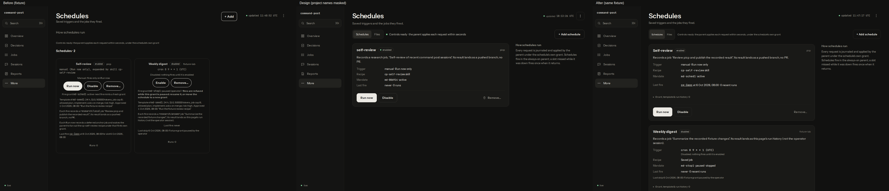
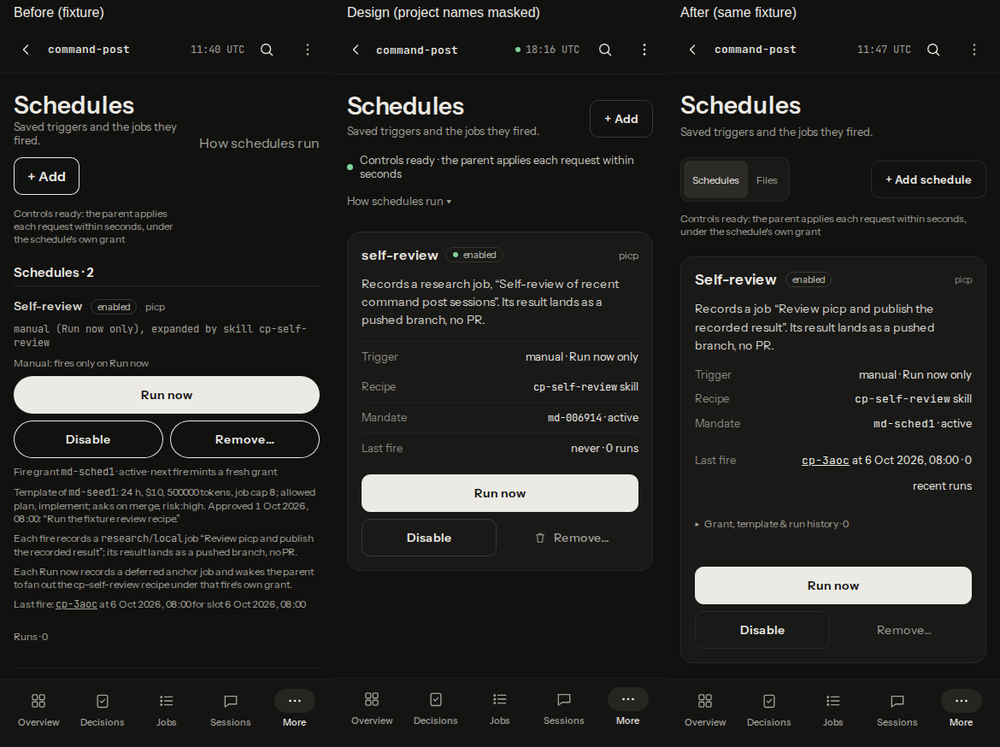

# v4 S11 Schedules visual verification

Scope: D35–D37. Based on current main at 609580b71c788419c36277acdacec704ea6007f9, which contains 05380ae / #114. Captures use only a synthetic fixture viewer at `http://127.0.0.1:18771/`; its home and scratch files are under this worktree's gitignored `.pi-command-post/s11-visual/`. No live operational data was used.

## Plan section for this slice

Approved S11 row, with the superseded final acceptance sentence removed as required by the binding amendment:

| Slice | Impact / differences | Allowance | Acceptance | Files |
|---|---|---:|---|---|
| S11 | Schedules design structure: D35–D37 | 450 | Wide desktop schedule card + explanatory aside, labelled fact rows and clear result description; phone concise primary facts with advanced grant/template/history details in disclosure. Action order/confirmation/refusal remains intact; Remove subdued and separated; Files nav and Add schedule label present. | Schedules.tsx, schedules.css, viewer-schedules.test.ts, viewer-schedule-control-ui.test.ts |

Verbatim file-list entries:

| Exact path | Exact change |
|---|---|
| viewer-app/screens/Schedules.tsx | S11 Schedules/Files links, Add schedule label, fact-based wide card/aside and disclosure of technical/template details. |
| viewer-app/screens/schedules.css | S11 desktop layout and primary/secondary/subdued actions, phone card hierarchy. |
| tests/viewer-schedule-control-ui.test.ts | S11 action order/two-step remove/refusal preserved. |

The planned Schedules test coverage is applied to manual/stopped/error states under the amendment, alongside facts/navigation. The existing projection and controller are reused.

Binding amendments (from the task):

- Per slice: one PR, at most 800 changed lines. The PR body carries a "Plan section for this slice" (excerpt of your slice from the plan, because diff-only reviewers can't read home paths) and a "Changelog line". Do NOT edit CHANGELOG.md, except the slice that says it is the last one: it writes ONE combined entry for the whole build.
- Visual proof is mandatory. Run the plan's compare.cjs against a local FIXTURE viewer on 127.0.0.1, never live data or state/. Attach before, design and after captures for your slice's D IDs to the PR as images, or put them in your run artifact and link them from the PR body.
- Keep the #101/#102 evidence semantics and the #110 composer height.
- Dependencies: S5 lands before S6; S8 re-verifies S1 and #110; S11 targets main at 05380ae or later: #114 changed Schedules.tsx, so keep its "stopped/move" wording and the migration skip reason, and drop the plan's "refire approval evidence" phrase (refire no longer exists).
- Verification: run only touched tests via `npm run test:one -- tests/<x>.test.ts` plus `npm run typecheck`; never the full `npm test` (CI owns it). Push after every commit. Open the PR as the usual draft flow.
- Tools you see under models: all work uses the model you were given; do not change it.

Additional binding amendments:

> Mask any non-picp project name in design-side captures before committing; the artboards contain a private project name. Blank every project name other than picp and the fixture names (solid box or a "project" placeholder; a crop is acceptable). Never name that project anywhere: PR text, commit messages, notes or reports. No commit may ever contain an unmasked capture.

> The diff-only reviewer (openai/gpt-6.1-sol) cannot read home paths or the PR body. From your first push, docs/tui-verification/v4-sN.md (N = your slice number) must contain, under the heading "Plan section for this slice", the verbatim section of the approved plan for your slice (D IDs, files, acceptance criteria, plus the binding amendments above), and a short table mapping each acceptance criterion to the file/test that satisfies it. Before/design/after captures there too. No private project name.

> Rebase on current main. Keep #114's schedule wording ("stopped"/"move to a new grant") and the migration skip reason; there is no refire anymore, so drop the plan's "refire approval evidence" phrase.

## Acceptance mapping

| Acceptance criterion | File / runnable evidence |
|---|---|
| D35: wide card, explanatory aside, labelled facts, clear result | `Schedules.tsx`: scoped card/layout, ordered Trigger/Recipe/Mandate/Last fire definition list, result destination. `schedules.css`: flexible full-width card with 288 px aside from 1200 px; 900–1199 px puts the explanation below the list. `viewer-schedules.test.ts`: real fixture render asserts the ordered labels, aside and primary result destination. |
| D35: concise phone facts; advanced grant/template/history disclosure | `Schedules.tsx`: native collapsed details keeps the complete approval, grant state/recovery, raw trigger/kind/delivery, deferred-anchor explanation, slot and recorded run results. `viewer-schedules.test.ts`: collapsed disclosure, approval/history, manual/cron/watch, error/empty, parent/system revokes, operator/legacy stops and verbatim migration reason. Browser Enter opens the disclosure at all three widths. |
| D36: order, confirmation and refusal intact | `ScheduleControls` retains its implementation. `viewer-schedule-control-ui.test.ts`: Run now/Disable/Enable and two-tap Remove; unavailable status, offline parent, sending/queued requests disable all actions; refusal remains an alert. Existing exact POST-body/token tests pass. |
| D36: Remove subdued and separated | `schedules.css`: filled primary, bordered secondary, muted borderless Remove at the right; full-width phone Run now. Browser verifies minimum 44 px targets and 479 px separation from Disable at 1440 px. |
| D37: Files navigation and Add schedule | `Schedules.tsx` reuses route-table destinations and existing `composerHref` draft. `viewer-schedules.test.ts` checks current Schedules/Files links and the full label; browser Files navigation and Add draft pass. |
| Preserve #114 and #101/#102/#110 | Existing stopped/move and migration regressions pass; the evidence producers and Sessions/composer files are unchanged. No schedule execution or authorization changes. |

## Before, design and after

The contact sheets show before (fixture), design, and after (same fixture), left to right. Design project identifiers are replaced with `project` in the DOM before writing any screenshot; published captures were visually inspected before staging. Counts and times are fixture records, not production constants.





[Phone disclosure: complete template approval and technical details](v4-s11/details-phone.png)

The fixture has two schedules rather than the artboard's one, and one last-fire record rather than "never". Recent-run counts use the existing bounded history projection; they are not total execution counts. The phone list scrolls normally; actions and history remain reachable.

The supplied compare.cjs was adapted only for worktree output/import paths, loopback-only requests, the existing synthetic Overview fixture, synthetic ready schedule controls, privacy replacement before design capture, and Sessions readiness compatible with an unavailable fixture session. Its 25-artboard manifest and credential redaction remain. All 25 before pairs and all 25 after pairs have identical dimensions. Only S11 captures are published.

Browser checks (GET only, zero attempted mutations):

| Viewport | Page width | Card width | Explanation | Long text / disclosure / 44 px targets |
|---|---|---|---|---|
| 390 px | 390 px | 358 px | below list | pass |
| 900 px | 900 px | 588 px | below list | pass |
| 1440 px | 1440 px | 808 px | beside list | pass |

Long text includes unbroken schedule/project labels, a long recipe title, a long approval quote and a long skip reason. Checks reload the fixture response for each case, verify the stress title is rendered, and test both collapsed and expanded content for page/card overflow. Files navigation, Add's composer draft and the first Remove tap pass. Live control writes were not attempted; controller interactions are exercised in the unit test.

Scratch commands:

```sh
node .pi-command-post/s11-visual/fixture.ts
./bin/cp-view --home "$PWD/.pi-command-post/s11-visual/fixture-home" --host 127.0.0.1 --port 18771 --require-tailnet
TMPDIR="$PWD/.pi-command-post/s11-visual/scratch" node .pi-command-post/s11-visual/compare.cjs --base http://127.0.0.1:18771/ --out .pi-command-post/s11-visual/after
TMPDIR="$PWD/.pi-command-post/s11-visual/scratch" node .pi-command-post/s11-visual/verify.cjs
```

## Focused verification

The new render regression failed on the baseline's missing Schedules/Files navigation and passes after the change. Run individually:

- `npm run typecheck`
- `npm run test:one -- tests/viewer-schedules.test.ts` — 16 tests
- `npm run test:one -- tests/viewer-schedule-control-ui.test.ts` — 2 tests
- `npm run test:one -- tests/contracts-exports.test.ts` — 1 test

`npm run eval:contract` passed 27/27 scored cases. The required `CP_UPDATE_GOLDEN=1` run regenerated the exports golden and requested its ordinary rerun, which passed. Both generated files match their tracked contents. LSP diagnostics were unavailable; the repository typecheck supplies type validation. No full local suite was run.

No pi/agent run was needed, so no agent directory or authentication was used. The local fixture server is stopped using only its recorded PID after captures. No runtime dependency or shared module was added. CHANGELOG.md is unchanged because S12 owns the combined entry.

Changelog line: Refine Schedules with wide labelled cards, a desktop explanation aside, compact phone facts, advanced grant/template/history disclosure, clear action hierarchy, and Schedules/Files navigation.
