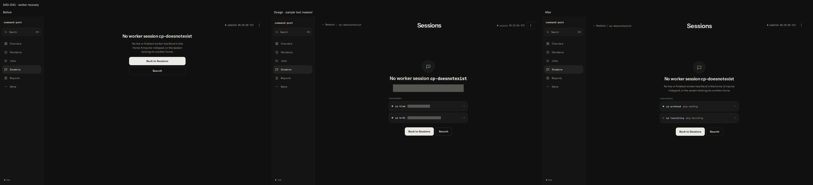
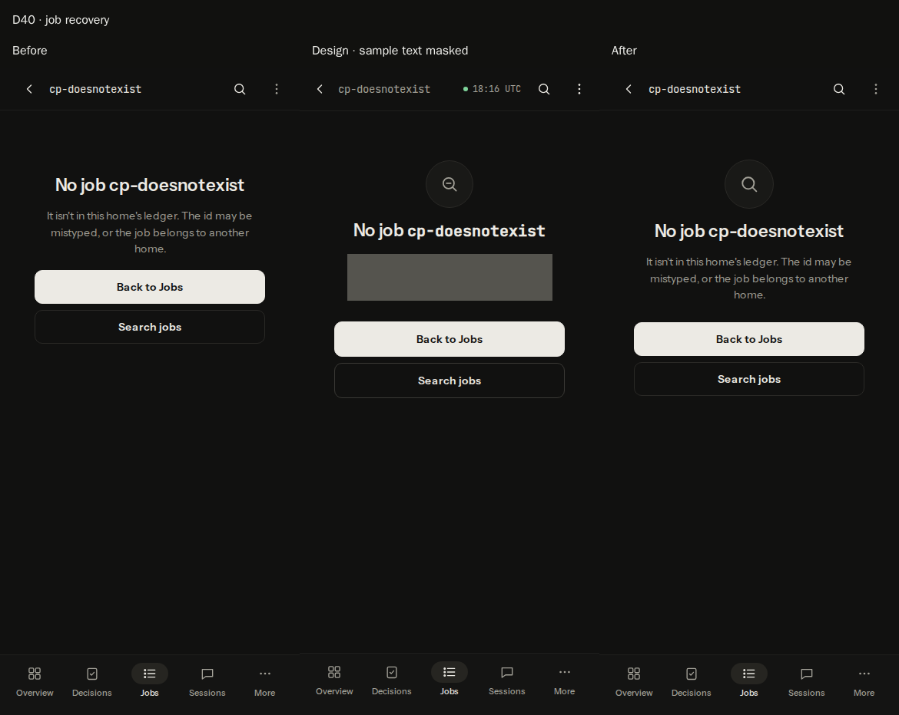
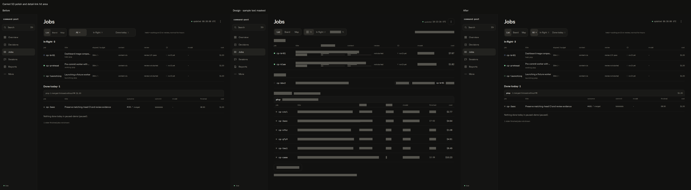
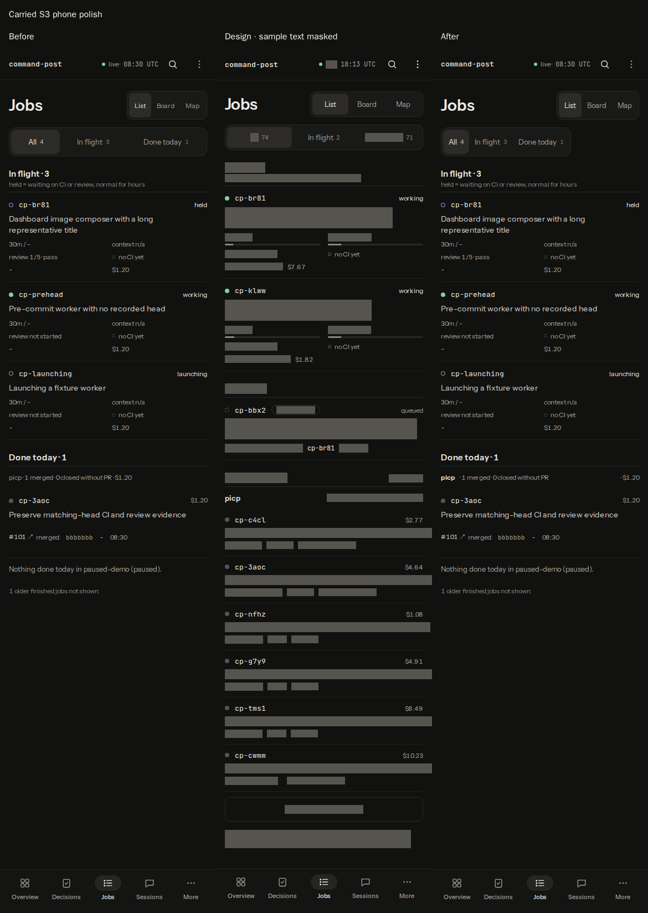
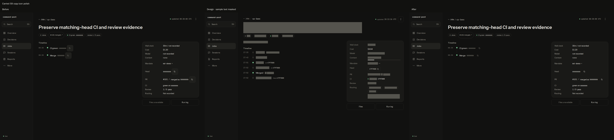
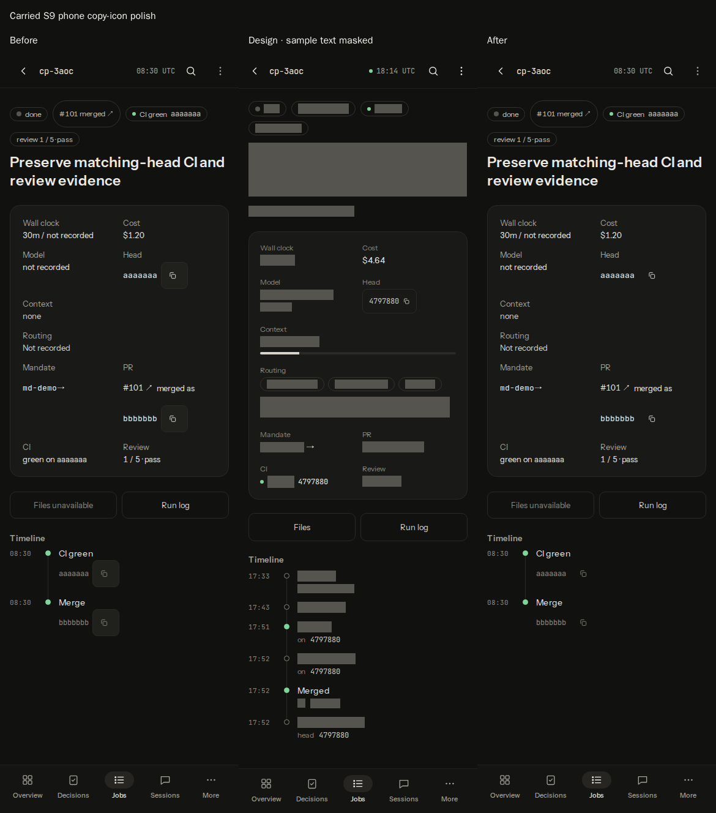

# v4 S12: 404 recovery and final polish

Scope: D40–D41, the S3/S9 carry-over items named in the task, and the single combined S1–S12 changelog entry. Base: `4c03b44a420ba1b74a80ce090567edc058ffbbb3`. Current main already includes S6 / #124; its Map files remain untouched by this slice.

## Plan section for this slice

Verbatim approved implementation-order row:

| Slice | Impact / differences | Allowance | Acceptance | Files |
|---|---|---:|---|---|
| S12 | 404 visual recovery: D40–D41 | 280 | Circular icon, desktop Sessions title/breadcrumb/wider recovery block, horizontal desktop actions; real available worker links, no fabricated suggestions when none known. Phone back/search remain 44 px and calm. Only 404 maps to this state. | app.tsx, NotFound.tsx, not-found.css, viewer-not-found.test.ts |

Verbatim approved file-list entries:

| Exact path | Exact change |
|---|---|
| viewer-app/app.tsx | S12 supply optional known worker alternatives from existing OverviewResponse.in_flight to missing worker screen, filtered to observed working/launching; do not fetch a transcript for suggestions. |
| viewer-app/components/NotFound.tsx | S12 kind-specific icon, optional breadcrumb/heading/worker alternatives and responsive actions. |
| viewer-app/components/not-found.css | S12 circular illustration and desktop wide centered recovery layout; keep phone geometry. |
| tests/viewer-not-found.test.ts | S12 icons/breadcrumbs/real suggestions; no suggestions on unavailable evidence and only 404 mapping. |

Verbatim approved S12 test-plan row:

| Stage | Runnable command | Expected result / what it proves |
|---|---|---|
| S12 | `npm run test:one -- tests/viewer-not-found.test.ts tests/viewer-app-navigation.test.ts` | All pass; icons/real suggestions and 404 navigation behavior. |

Binding amendments from the task (the 800-line amendment also covers the carried-over polish):

- Per slice: one PR, at most 800 changed lines. The PR body carries a "Plan section for this slice" (excerpt of your slice from the plan, because diff-only reviewers can't read home paths) and a "Changelog line". Do NOT edit CHANGELOG.md, except the slice that says it is the last one: it writes ONE combined entry for the whole build.
- Visual proof is mandatory. Run the plan's compare.cjs against a local FIXTURE viewer on 127.0.0.1, never live data or state/. Attach before, design and after captures for your slice's D IDs to the PR as images, or put them in your run artifact and link them from the PR body.
- Keep the #101/#102 evidence semantics and the #110 composer height.
- Dependencies: S5 lands before S6; S8 re-verifies S1 and #110; S11 targets main at 05380ae or later: #114 changed Schedules.tsx, so keep its "stopped/move" wording and the migration skip reason, and drop the plan's "refire approval evidence" phrase (refire no longer exists).
- Verification: run only touched tests via `npm run test:one -- tests/<x>.test.ts` plus `npm run typecheck`; never the full `npm test` (CI owns it). Push after every commit. Open the PR as the usual draft flow.
- Tools you see under models: all work uses the model you were given; do not change it.

Additional binding task text:

> S12 of the plan's 12 slices.
> You are the LAST slice: write the ONE combined CHANGELOG.md entry for the whole v4 design-fix build (all 12 slices) in this PR.

> Mask any non-picp project name in design-side captures before committing; the artboards contain a private project name. Blank every project name other than picp and the fixture names (solid box or a "project" placeholder; a crop is acceptable). Never name that project anywhere: PR text, commit messages, notes or reports. No commit may ever contain an unmasked capture.

Carried-over polish items from S3 (main session, low priority; fold in as extra items if within the 800-line cap):

- (a) The Jobs view toggle (List/Board/Map) text is smaller than the design, and the filter pills are stretched wide; the design uses compact pills.
- (b) The project group header should show a bold "picp" name, then the counts, then the cost.
- (c) "Show N more from picp" should be a bordered button.
- (d) The failed row's "ledger closed" chip and the second reason line add height the design doesn't have.

> viewer-app/screens/jobs.css:101 — at >=1200px, `display: contents` removes the job-detail anchor's box, leaving small ID/title hit areas, so the required 44px target is lost. Give that anchor a >=44px hit area without covering the separate PR link, and verify it in the browser (add a CSS contract test).

> The diff-only reviewer (openai/gpt-6.1-sol) cannot read home paths or the PR body. From your first push, docs/tui-verification/v4-sN.md (N = your slice number) must contain, under the heading "Plan section for this slice", the verbatim section of the approved plan for your slice (D IDs, files, acceptance criteria, plus the binding amendments above), and a short table mapping each acceptance criterion to the file/test that satisfies it. Before/design/after captures there too. No private project name.

> The job-detail copy buttons render as visible 44 px bordered boxes beside every SHA, so timeline rows look tall and jumpy. Keep the 44 px hit area but make it invisible padding around a small icon, as in the artboard.

> Branch from current origin/main. Do NOT touch viewer-app/screens/MapGraph.tsx or any map.css: those are S6's (PR #124, still open). Any Map-related polish waits for a follow-up after S6 lands.

## Acceptance mapping

| Acceptance criterion | File / runnable evidence |
|---|---|
| D40: circular kind-specific illustration | `NotFound.tsx` reuses existing search/session SVGs; `not-found.css` supplies the neutral 64 px circle. `viewer-not-found.test.ts` checks both rendered shapes and the illustration contract. |
| D41: Sessions title, breadcrumb, wider recovery, horizontal desktop actions | `NotFound.tsx` has a desktop header and breadcrumb to Sessions; `not-found.css` centers a 420 px inner recovery area with horizontal actions at 900 px and up. Render/CSS tests plus 1440 px browser comparison. |
| Real available worker links; no fabricated suggestions | `app.tsx` passes the already-loaded Overview flight records only when their fleet/ledger evidence is available and the overview refresh has no error. `notFoundFor` retains only working/launching model workers, excludes scripts and the missing ID, and uses `sessionHref`. The mounted App regression checks available/unavailable evidence and verifies no transcript lookup. |
| Phone Back/Search remain calm, at least 44 px | `not-found.css` keeps vertical, full-width actions with minimum 44 px height. Browser checks open Search, Escape, Back to Jobs, and selecting an observed worker; both 390 and 1440 px pass. |
| Only 404 maps to recovery | `notFoundFor` keeps the existing 404 gate. Tests cover 403/500/undefined, nonworker Sessions and unrelated routes; the mounted App keeps 403/500 as View unavailable. |
| S3 polish and required Jobs target | `Jobs.tsx` renders a bold project name, then counts and cost; ledger disagreement stays in the finished link's title while its chip is hidden. `jobs.css` gives compact filter sizing, a bordered expansion button, one-line finished reasons and a subgrid link spanning only ID/title columns. `viewer-jobs-render.test.ts` preserves grouping, facts and expansion and locks the 44 px anchor contract. Browser hit-tests the bottom edge and separate PR link. |
| S9 copy-icon polish | `job-detail.css` overrides the inherited border/background with transparent 15 px padding around the existing 14 px icon. `viewer-job-detail-render.test.ts` locks the styling and full SHA render/copy evidence; `viewer-copy-reply.test.ts` preserves clipboard success/failure/lifecycle behavior. Browser measures 44×44 px and copies the exact full fixture SHA. |
| Combined changelog, evidence semantics and composer height | `CHANGELOG.md` adds one S1–S12 entry. CI/review producers, Map and Sessions/composer files are unchanged; job-detail rendering retains matching-head values, and the comparison includes the current Sessions fixture at both sizes. |

## Before, design and after

Every sheet is ordered before (fixture), design, after (same fixture), left to right. The design capture uses an allowlist of shared UI labels and safe fixture identifiers: other designer sample text, project names and image/form/canvas content are covered **before** a PNG is written. Conservative masking also covers some non-project sample copy. No unmasked design capture is published or committed. Fixture captures contain only `picp` and synthetic fixture projects; no live state or credentials were used.













Long-text checks: [390 px recovery](v4-s12/long-404-390-worker.png), [1440 px recovery](v4-s12/long-404-1440-worker.png), [390 px Jobs](v4-s12/long-jobs-390.png), [1440 px Jobs](v4-s12/long-jobs-1440.png). A 900 px transition-width check also passed. IDs contain 123 characters; titles and project names include long unbroken strings. Finished-group expansion still changes five rows to six. Full reasons remain in their title and detail view.

Bordered expansion button: [390 px](v4-s12/more-jobs-390.png), [1440 px](v4-s12/more-jobs-1440.png). The expanded long-text fixtures include a failed row: its full ledger disagreement remains in the job link title, the chip is hidden, and its reason is visibly clamped to one line.

The supplied compare.cjs was adapted for loopback-only fixture requests, worktree import/output paths and pre-capture privacy masking. Its full 25-artboard manifest and credential-text redaction remain. All 25 before pairs and all 25 after pairs matched their design PNG dimensions; zero non-GET attempts. Only this slice's comparisons are published. These checks compare hierarchy and geometry, not equality of designer sample data.

Browser observations:

| Check | Before | After |
|---|---|---|
| 404 circular icon | absent | 64 px search/message circle |
| Worker alternatives | absent | working `cp-prehead`, launching `cp-launching`; held/idle/failed/script records excluded |
| Desktop recovery actions | two stacked 44 px buttons | one horizontal 44 px row |
| Desktop Jobs detail anchor | 0×0 px (`display: contents`) | every tested anchor at least 44 px high; bottom-edge hit belongs to job link, PR hit belongs to separate PR link |
| SHA copy target | 44×44 px, 1 px visible border and button fill | 44×44 px, zero border and transparent fill, 14 px icon; full value copied |
| Long text at 390 / 900 / 1440 px | — | no page/recovery overflow; Jobs expansion and links work |

The desktop Jobs row needs 65 px minimum total height: 44 px target + 20 px vertical padding + 1 px divider. The original 64 px height constrained the subgrid link to 43 px; the browser check caught and fixed that one-pixel loss.

## Verification

Run individually before and after the delivery rebase:

- `npm run typecheck`
- `npm run test:one -- tests/viewer-not-found.test.ts` — 5 tests
- `npm run test:one -- tests/viewer-app-navigation.test.ts` — 2 tests
- `npm run test:one -- tests/viewer-jobs-render.test.ts` — 5 tests
- `npm run test:one -- tests/viewer-job-detail-render.test.ts` — 8 tests
- `npm run test:one -- tests/viewer-copy-reply.test.ts` — 6 tests including subtests
- `npm run test:one -- tests/contracts-exports.test.ts`

The new 404 and Jobs hit-area regressions failed on the original tree and pass with the fix. Active LSP diagnostics were unavailable (no ready TypeScript client); the repository typecheck provides type validation. No full local test suite is run.

Required regeneration: `npm run eval:contract` and `CP_UPDATE_GOLDEN=1 npm run test:one -- tests/contracts-exports.test.ts`; the ordinary exports test is rerun after updating. Generated contract results and exports golden match their tracked versions.

Local visual commands (all scratch/fixture state lives under the worktree's ignored `.pi-command-post/s12-visual/`, served at `http://127.0.0.1:18772/`):

```sh
node .pi-command-post/s12-visual/fixture.ts
TMPDIR="$PWD/.pi-command-post/s12-visual/scratch" node .pi-command-post/s12-visual/compare.cjs --base http://127.0.0.1:18772/ --out .pi-command-post/s12-visual/after
TMPDIR="$PWD/.pi-command-post/s12-visual/scratch" node .pi-command-post/s12-visual/verify.cjs
TMPDIR="$PWD/.pi-command-post/s12-visual/scratch" node .pi-command-post/s12-visual/sheets.cjs
```

No pi/agent run was needed, so no agent directory or authentication was used. Only the fixture server's recorded PID is signalled for cleanup. No dependency, API endpoint or runtime helper was added. The credential audit of the branch history prints counts only.

Changelog line: Complete the dashboard v4 design fixes across all twelve slices, preserving recorded evidence and composer behavior while restoring responsive hierarchy, compact facts and controls, and calm 404 recovery with observed worker links.
