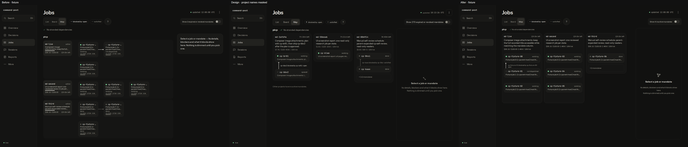
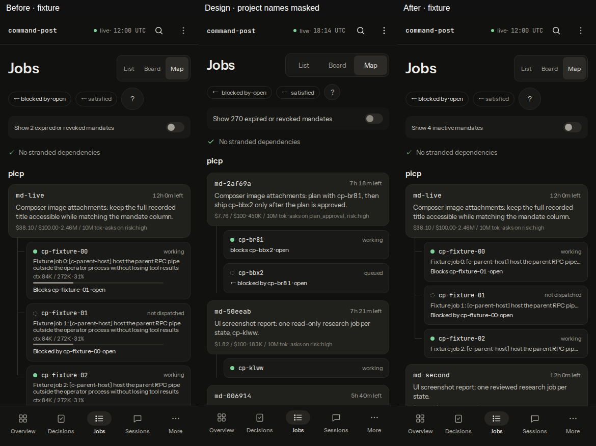

# v4 S6 Map columns, labels and controls verification

S6 implements D24–D25 and the binding PR #124 revision below. The desktop now follows the `jobs-map--desktop` artboard's mandate columns instead of S5's wrapped rows. All browser evidence uses a deterministic fixture viewer built from this worktree at `http://127.0.0.1:8767/`. The fixture home, scripts and raw captures are under the gitignored `.pi-command-post/v4-s6/`; no operational home or live viewer was used.

## Plan section for this slice

Verbatim S6 section from the approved plan:

| Slice | Impact / differences | Allowance | Acceptance | Files |
|---|---|---:|---|---|
| S6 | Map labels and controls: D24–D25 | 360 | Visible mandate objectives and job labels abbreviate with full accessible text; reserve adequate node height in S5 geometry. Compact Jobs header/legend and separate phone full-width history control match artboard hierarchy. Preserve existing history membership, null selection, in-flow panel and all accessible node links. | MapGraph.tsx, DependencyMap.tsx, map.css, viewer-mandates-map-render.test.ts |

Verbatim file-list entries for this slice (S5 edits have already landed):

| Exact path | Exact change |
|---|---|
| viewer-app/screens/MapGraph.tsx | S5 compute bounded multirow/dependency-depth positions instead of x=220+i*160 for every job, preserving node/edge membership; S6 visible objective/title text with accessible full labels. |
| viewer-app/screens/DependencyMap.tsx | S6 compact Jobs header/legend and phone full-width history control; preserve null initial selection and in-flow aside. |
| viewer-app/screens/map.css | S5 adaptive graph dimensions/scroll ownership; S6 node/objective text and compact controls; keep 288 px in-flow aside. |
| tests/viewer-mandates-map-render.test.ts | S5 bounded geometry/all-node reachability/initial undimmed state with the same history membership; S6 objective/label/control rendering and local-day history regression. |

> S1 precedes all layout-dependent captures. S5 precedes S6; S8 re-verifies S1/#110. Serialize these verification dependencies; other slices can be independently scoped after gating. S4 adopts the column-first default explicitly shown in both Board artboards. S5/S6 preserve the current Map record/history membership and repair geometry rather than inventing a data-retention rule.

> S5 preserves all existing visible dependency endpoints and history membership when computing positions. The graph must tolerate cycles and long IDs, retain full accessible titles, and scroll when a connected component cannot fit. S6 text sizing must be reflected in edge geometry rather than overlapping nodes. Expired/revoked mandate history stays explicit; no records are hidden or deleted to improve the screenshot.

Binding amendments (main session, verbatim intent):

- Per slice: one PR, at most 800 changed lines. The PR body carries a "Plan section for this slice" (excerpt of your slice from the plan, because diff-only reviewers can't read home paths) and a "Changelog line". Do NOT edit CHANGELOG.md, except the slice that says it is the last one: it writes ONE combined entry for the whole build.
- Visual proof is mandatory. Run the plan's compare.cjs against a local FIXTURE viewer on 127.0.0.1, never live data or state/. Attach before, design and after captures for your slice's D IDs to the PR as images, or put them in your run artifact and link them from the PR body.
- Keep the #101/#102 evidence semantics and the #110 composer height.
- Dependencies: S5 lands before S6; S8 re-verifies S1 and #110; S11 targets main at 05380ae or later: #114 changed Schedules.tsx, so keep its "stopped/move" wording and the migration skip reason, and drop the plan's "refire approval evidence" phrase (refire no longer exists).
- Verification: run only touched tests via `npm run test:one -- tests/<x>.test.ts` plus `npm run typecheck`; never the full `npm test` (CI owns it). Push after every commit. Open the PR as the usual draft flow.
- Tools you see under models: all work uses the model you were given; do not change it.

Binding PR #124 revision (main session, supersedes S5 geometry and the original default-history visibility):

- Follow the `jobs-map--desktop` artboard's structure: side-by-side mandate columns; headers show ID, time left, objective, spend/budget and tokens; compact vertical job tiles show dot, ID, phase and a one-line title, with no context bars.
- Label vertical dependencies `cp-x blocked by cp-y · open`; collapse additional finished jobs into an expandable `+N more done` line; allow horizontal column scrolling; use a full-height right selection pane with an icon and “Select a job or mandate”.
- Keep every job reachable and historical membership intact. Inactive or expired mandates are accessible only through the existing history toggle. S5 geometry may change for this revision.
- Keep the complete PR at or below 800 changed lines; split into S6a structure and S6b labels only if necessary. Refresh masked before/design/after captures using the fixture viewer on 127.0.0.1; retain this plan section, criterion table and masking rule. Explain why the columns replace S5's wrap rows.
- Run touched tests, every `tests/viewer-*map*` test, other viewer tests touching Map, and typecheck. Push on the existing PR.

The artboard groups each mandate's work in a column, with dependencies running between vertically stacked jobs. S5's depth-based rows spread those jobs across a lane and cannot reproduce that structure. This authorized revision replaces that layout while keeping recorded jobs, dependencies, evidence and selection behavior. The original 360-line planning allowance is superseded by the revision's 800-line PR ceiling; the complete change fits one PR, so no S6a/S6b split is needed.

Privacy rule (main session, binding):

> Mask any non-picp project name in design-side captures before committing; the artboards contain a private project name. Blank every project name other than picp and the fixture names (solid box or a "project" placeholder; a crop is acceptable). Never name that project anywhere: PR text, commit messages, notes or reports. No commit may ever contain an unmasked capture.

Plan section in the diff, from the FIRST push (main session, binding):

> The diff-only reviewer (openai/gpt-6.1-sol) cannot read home paths or the PR body. From your first push, docs/tui-verification/v4-sN.md (N = your slice number) must contain, under the heading "Plan section for this slice", the verbatim section of the approved plan for your slice (D IDs, files, acceptance criteria, plus the binding amendments above), and a short table mapping each acceptance criterion to the file/test that satisfies it. Before/design/after captures there too. No private project name.

| Acceptance criterion | File/test and evidence |
|---|---|
| D24: visible mandate objectives and job titles with full accessible text | `MapGraph.tsx` renders header ID/expiry, three-line objective, spend/budget and tokens; 58 px job tiles show dot, ID, phase and one-line title. Full names/titles remain accessible. `DependencyMap.tsx` keeps full phone link names. Render regressions check text, escaping, metrics and removal of tile context bars. |
| Artboard mandate columns replace S5 wrapped rows | `MapGraph.tsx`'s `mapLayout` assigns a 252 px column per mandate and vertically stacks 228×58 px jobs with 36 px routing gaps. `map-edges.ts` routes dependencies around those cards. Geometry tests cover columns, routing clearance, cycles and overflow; Chromium verifies label/card clearance at 1440/1024 px. |
| Labelled vertical dependencies | `MapGraph.tsx` renders `dependent blocked by blocker · kind` beside vertical edges, retaining full labels in titles. Multiple blockers share a label instead of overlapping. `edgePoints` routes skipped, backwards, self and cross-column links through gutters/card gaps. Render and geometry regressions cover these cases. |
| Expandable finished jobs | `mapJobs` retains one finished preview and exposes the exact remaining count through `+N more done`. Desktop expansion restores all cards/edges; phone details retain every job link. Mounted tests and Chromium verify expansion, counts and clearing a selection hidden by collapse. |
| D25: compact Jobs header and legend | `DependencyMap.tsx`/`map.css` align view/legend/history controls on desktop; phone Jobs and the view toggle share a row. Two relation chips lead to the complete legend. The healthy desktop status shares the project heading. Mounted coverage opens/closes all phase/relation explanations. |
| Separate full-width phone history control | The labeled checkbox retains a 44 px target. At 390 px Chromium measures a separate 358×44 px row after the legend; Space toggles it. |
| Recorded history membership and explicit inactive visibility | `visibleMandates` defaults to active grants only. History exposes paused, closed, expired and revoked grants with their recorded jobs. Render tests cover their membership and selection; projection tests preserve close/revocation-day semantics. No record is deleted or relabeled. |
| Null selection and full-height in-flow panel | The right aside stays 288 px wide, stretches to the workspace's full height and shows the Map icon and selection prompt. Tests/browser checks verify initial undimmed state, keyboard selection, clear and history/collapse selection removal. |
| Every job remains reachable; horizontal scroll belongs to the graph | Phone links and desktop selection/Open job paths remain intact. All 227 long-label nodes/links survive; the last is reachable. Twelve overflowing columns scroll inside the graph while the page width equals the viewport. Geometry tests retain every node and historical endpoint. |

## Before, design and after

Each contact sheet retains original-resolution captures left to right: **before fixture / masked design / after fixture**.

- [D24–D25 desktop, 1440×900 per capture](v4-s6/desktop.png)
- [D24–D25 phone, 390×844 per capture](v4-s6/phone.png)





Design project headings other than picp and the project-bearing footer are replaced in the DOM before any design screenshot is written. The masked captures and final sheets were visually inspected. No unmasked design capture enters a commit.

The supplied `compare.cjs` was adapted for this worktree's import/output paths, project-name masking and an optional map-only baseline. The final run retains all 25 artboards, identical pair dimensions, credential text redaction, image masking and a GET-only browser guard. The Sessions readiness check accepts unavailable controls in the fixture. Other routes use empty/control-unavailable fixture states; these captures make no fidelity claim for another slice.

Before shows the original PR #124 row layout (`19077cb9`) using the same fixture as after. The fixture has three active mandates, nine jobs, open/satisfied dependencies, finished jobs and a historical job; paused, closed, expired and revoked grants exercise the history toggle. Column/job order remains deterministic input order within the existing project/mandate grouping. Only Map presentation/history visibility changed; the projection, evidence producers, Shell, Sessions and composer remain untouched.

## Browser results

| Check | Result |
|---|---|
| Long text at 390/1440/1024 px | Page width equals viewport width; desktop titles remain one line and every child fits its 58 px job tile. No tile context bars remain. |
| Phone hierarchy | Jobs/view toggle share a row; legend precedes a separate 358×44 px history row; finished-job details retain all links. |
| Desktop hierarchy | At 1440/1024 px controls share a row; three mandate columns align side by side. Headers expose expiry/objective/budget/tokens. At 1024 px the 780 px canvas scrolls inside a 400 px pane. |
| Panel/selection | Aside is 288×705 px, matching the workspace height at both desktop sizes. Initial icon/prompt has no dimming; Enter selects; collapsing a selected finished job or hiding history clears selection. |
| History/legend | Space exposes all inactive grants and their historical job; hiding history removes them. Full phase/relation legend opens/closes. |
| Finished jobs | Seven preview/live tiles expand to all nine; `+2 more done` reports the exact count. Phone details expose the two hidden links. |
| 227 jobs with long labels | All nodes/links remain present; the last desktop node is vertically scrollable/selectable and the last phone link is reachable. |
| 12 overflowing columns | The final mandate/job is reachable through graph horizontal scrolling; page width stays 1440 px. |
| Requests | Zero non-GET requests attempted. |

The legend keeps a 44 px tap target. Long objectives clamp to three lines on desktop and two on phone, job titles to one, and grouped dependency labels to two, with full text accessible. The first finished job is a compact preview; expansion restores the remaining jobs and their visible edges. Fixture counts remain truthful rather than copied from the artboard. Unknown closure dates say “closed” without inventing a day; closed dependency targets retain the existing healthy-status rule.

## Checks and reproduction

The original S6 label regression failed on the baseline (`Map` instead of `Jobs`). The column regression failed against the original row implementation before this revision's geometry change. A phase assertion also failed with “stranded” instead of the recorded “failed”; compact tiles now retain their phase. All 71 focused tests pass; files run separately before and after syncing the latest main:

- `npm run typecheck`
- `npm run test:one -- tests/viewer-mandates-map-render.test.ts`
- `npm run test:one -- tests/viewer-mandates-map.test.ts`
- `npm run test:one -- tests/viewer-map-edges.test.ts`
- `npm run test:one -- tests/viewer-app-navigation.test.ts`
- `npm run test:one -- tests/viewer-app-render.test.ts`
- `npm run test:one -- tests/viewer-app-http.test.ts`
- `npm run test:one -- tests/viewer-app-build.test.ts`
- `npm run test:one -- tests/viewer-context-usage.test.ts`
- `npm run test:one -- tests/viewer-jobs-qa.test.ts`
- `npm run test:one -- tests/viewer-jobs-render.test.ts`
- `npm run test:one -- tests/viewer-jobs.test.ts`
- `npm run test:one -- tests/viewer-job-detail-render.test.ts`
- `npm run test:one -- tests/viewer-performance.test.ts`
- `npm run test:one -- tests/viewer-search.test.ts`
- `npm run test:one -- tests/viewer-palette.test.ts`
- `npm run test:one -- tests/contracts-exports.test.ts`

Main advanced during the revision. Its changes are merged into this branch so the existing PR history can be pushed normally without rewriting commits. The complete PR is 496 changed text lines across nine files, below the 800-line ceiling; no split is needed.

Visual reproduction in this leased worktree:

```sh
node .pi-command-post/v4-s6/fixture-viewer.ts
TMPDIR="$PWD/.pi-command-post/v4-s6" node .pi-command-post/v4-s6/compare.cjs --base http://127.0.0.1:8767/ --out "$PWD/.pi-command-post/v4-s6/after-all"
TMPDIR="$PWD/.pi-command-post/v4-s6" node .pi-command-post/v4-s6/verify.cjs
node .pi-command-post/v4-s6/publish-proof.cjs
```

Browser contexts close in `finally`; the fixture server is stopped by its recorded PID after capture. No pi/agent run was required, so no agent directory or authentication was used. LSP diagnostics were unavailable; the repository typecheck supplies type validation. Contract regeneration uses `npm run eval:contract` (27/27 scored cases pass, 23 skipped) and `CP_UPDATE_GOLDEN=1 npm run test:one -- tests/contracts-exports.test.ts`, followed by its normal passing rerun. Both generated outputs have no tracked changes. Credential-pattern audit reports zero matches without printing any matching text.

## Changelog line

Show the dependency Map in compact mandate columns with complete headers, one-line job titles, labelled vertical dependencies, expandable finished jobs and a full-height selection pane; keep inactive mandates behind history and every job reachable.
